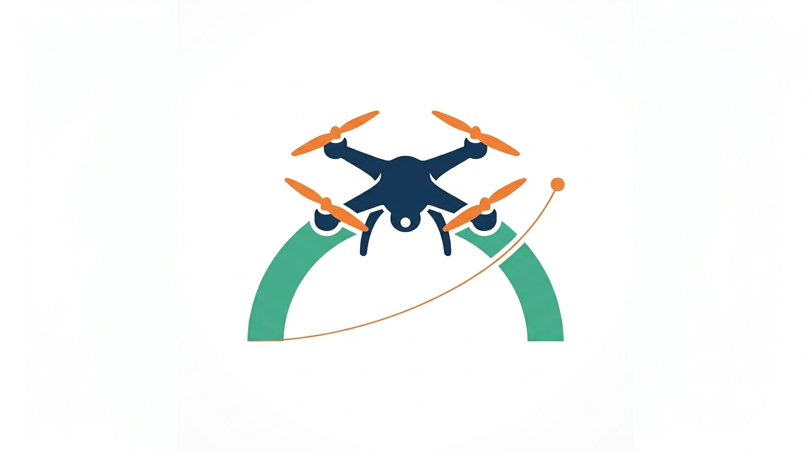

# arch-nav

 

Platform-agnostic UAV navigation framework. Handles operation control and vehicle state management with zero dependency on any specific autopilot or middleware.

## How to get started

This repository contains the core Arch-Nav framework. For a guided setup, installation instructions, and first-run examples, see the documentation: https://mdominmo.github.io/arch_nav/

## Build and install

### Dependencies
- CMake >= 3.16
- C++17 compiler
- yaml-cpp
- Driver-specific dependencies (e.g. MAVSDK for the MAVSDK driver)

Use the provided helper scripts to manage the build:

- `scripts/clean.sh` — clean previous build artifacts
- `scripts/build.sh` — configure and build the project

For more advanced installations and platform-specific setup, refer to the full documentation: https://mdominmo.github.io/arch-nav/
