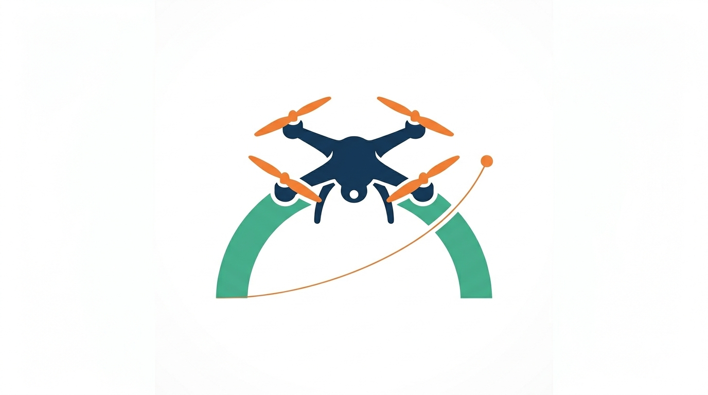

<div class="landing-hero" markdown>



# arch_nav

<p class="tagline">Platform-agnostic UAV navigation kernel written in C++17</p>

</div>

<div class="cta-row">
  <a href="getting-started/installation/">Get Started</a>
  <a href="architecture/overview/" class="secondary">Architecture</a>
  <a href="https://github.com/mdominmo/arch-nav" class="secondary">GitHub</a>
</div>

---

<div class="feature-grid" markdown>

<div class="feature-card" markdown>

### Autopilot-independent

A single API works across PX4, ArduPilot, or any future autopilot. Swap the driver at link time or runtime without changing application code.

</div>

<div class="feature-card" markdown>

### Operations model

Three action categories designed for UAV operations: long-running **navigation tasks**, confirmed **imperative commands**, and reactive **context updates** for situational awareness.

</div>

<div class="feature-card" markdown>

### Plugin drivers

Drivers are shared-library plugins discovered at runtime. Write a driver for your autopilot by implementing two interfaces: `IPlatformDriver` and `ICommandDispatcher`.

</div>

<div class="feature-card" markdown>

### Dual-context architecture

`VehicleContext` carries telemetry from the vehicle; `OperationContext` carries intent and awareness from the operator. Clear data-flow direction, no cross-contamination.

</div>

</div>

## Quick look

```cpp
#include <arch_nav/arch_nav.hpp>

auto nav = arch_nav::ArchNav::create();
auto& api = nav->api();

api.arm();
api.takeoff(10.0);

api.on_operation_complete([&](const auto& report) {
    std::vector<arch_nav::vehicle::Waypoint> wps = { /* ... */ };
    api.waypoint_following(std::move(wps));
});
```

## Documentation

| Section | Contents |
|---------|----------|
| [Getting Started](getting-started/installation.md) | Install, build, and run a minimal mission flow. |
| [Architecture](architecture/overview.md) | Kernel components, state model, and operations model. |
| [API Reference](api/arch-nav-api.md) | Public headers and integration contracts. |
| [Development](development/build-and-test.md) | Build/test workflows, driver authoring, concurrency notes. |

## Who this is for

- **Integrators** embedding `arch_nav` in ground stations, companion computers, or simulation harnesses.
- **Driver authors** implementing `IPlatformDriver` and `ICommandDispatcher` for new autopilot stacks.
- **Researchers** building on top of a documented, testable navigation abstraction.

<div class="citation" markdown>

<details>
<summary>Citing arch_nav</summary>

```bibtex
@software{dominguez2025archnav,
  author       = {Dom{\'\i}nguez, Manuel},
  title        = {arch\_nav: A Platform-Agnostic UAV Navigation Kernel},
  year         = {2025},
  url          = {https://github.com/mdominmo/arch-nav},
  note         = {C++17 library}
}
```

</details>

</div>

<div class="author-block" markdown>

Created by **Manuel Dominguez**

</div>
